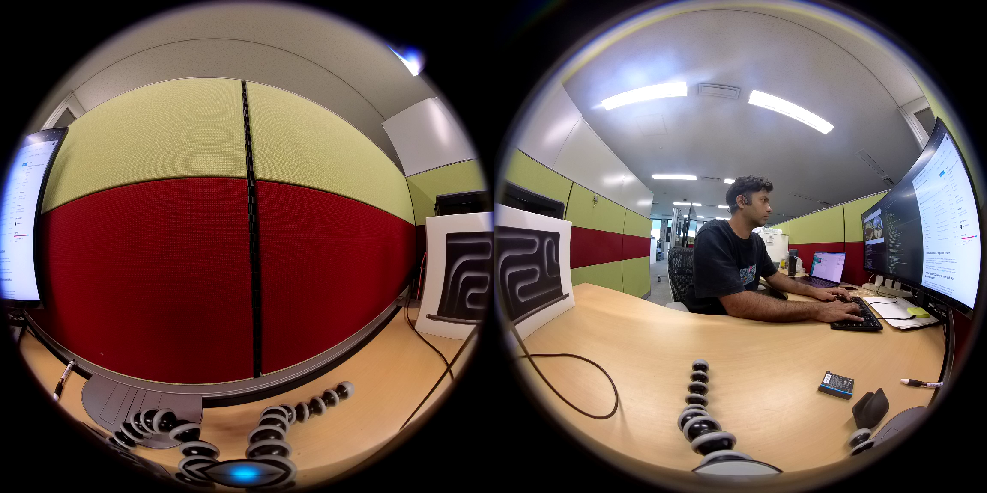
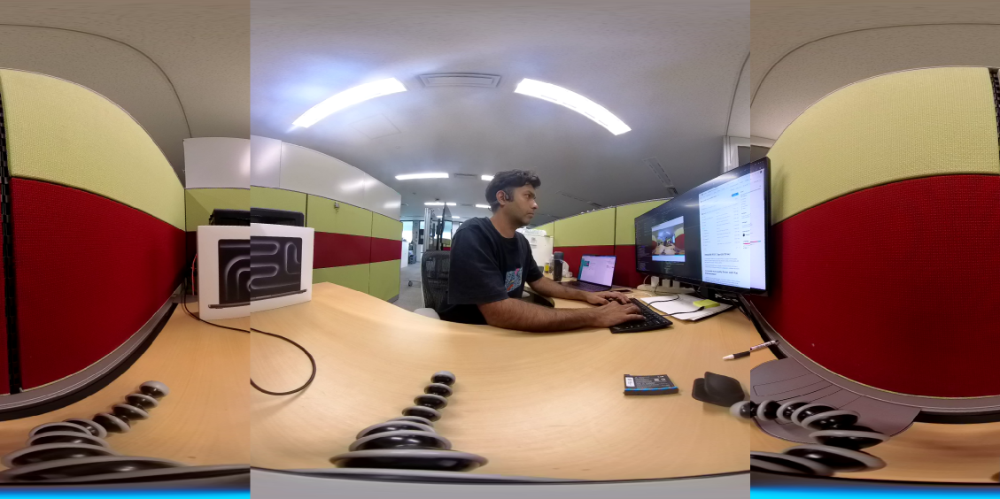
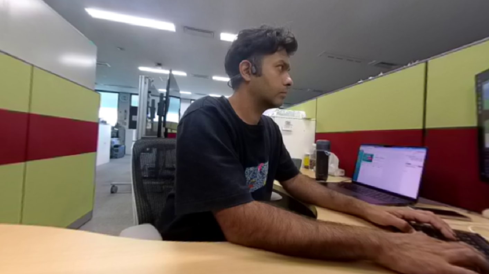

# Insta360 ROS 2 Jazzy Driver

ROS 2 Jazzy driver for capturing an Insta360 dual-fisheye stream, decoding
H.264, and producing a full-resolution equirectangular image with a native
C++/CUDA stitcher.

The driver is managed and built by the independent `panotrack` Pixi
environment in the parent repository.

## Current pipeline

```text
main.cpp
  → /dual_fisheye/image/compressed
decoder.cpp
  → /dual_fisheye/image
cuda_stitcher_node.cpp + cuda_stitcher.cu
  → /equirectangular/image
```

Component responsibilities:

- `main.cpp`: communicates with the proprietary Insta360 Camera SDK and
  publishes compressed H.264 packets.
- `decoder.cpp`: decodes H.264 packets into `bgr8` ROS images.
- `cuda_stitcher_node.cpp`: owns the ROS subscription, latest-frame queue,
  publisher, parameters, and performance statistics.
- `cuda_stitcher.cu`: runs the precomputed bilinear dual-fisheye-to-ERP remap
  on CUDA.
- `equilib_stitcher.py`: retained only as a Python/Torch fallback.

Both `main.cpp` and `decoder.cpp` are still required. The native CUDA
stitcher consumes the uncompressed `/dual_fisheye/image` output from the
decoder; it does not decode H.264 itself.

## Performance

Measured on an RTX 2080 Ti at 2304×1152:

```text
input=30.5 fps equirect=30.0 fps dropped=0
cuda=2.77 ms max_cuda=4.57 ms
```

The native implementation uses:

- a precomputed source-coordinate map;
- one CUDA bilinear-remap kernel;
- a non-blocking CUDA stream;
- pinned host output memory;
- a latest-frame ROS queue;
- `bgr8` end-to-end, avoiding an unnecessary BGR/RGB conversion.

The CUDA map is initialized before the image subscription is created so map
construction does not cause startup frame drops.

## Supported hardware

Tested with:

- Ubuntu 24.04
- ROS 2 Jazzy through RoboStack
- NVIDIA RTX 2080 Ti
- Insta360 X3
- CUDA 12.8 from the `panotrack` Pixi environment

The camera supports multiple 30 FPS modes, including:

- 3840×1920
- 2560×1280
- 2304×1152
- 1920×960
- 1152×1152

The launch file currently requests:

```xml
<param name="video_resolution" value="RES_1152_1152P30"/>
<param name="lrv_video_resolution" value="RES_1440_720P30"/>
```

The decoded dual-fisheye frame and stitched ERP output are both 2304×1152.

## Proprietary Insta360 SDK

Obtain the latest Linux Camera SDK from the
[Insta360 Developer portal](https://www.insta360.com/developer/home).

Place the SDK content as follows:

```text
include/
├── camera/
└── stream/

lib/
└── libCameraSDK.so
```

These proprietary files cannot be distributed by this repository.

## Camera USB setup

Set the camera to:

- dual-lens 360° mode;
- USB mode: **Android**.

Install the udev rule:

```bash
cd src/insta360_ros2_equilib_driver
./setup.sh
```

If necessary, install the rule manually:

```bash
echo SUBSYSTEM=='"usb"', ATTR{manufacturer}=='"Arashi Vision"', SYMLINK+='"insta"', MODE='"0777"' \
  | sudo tee /etc/udev/rules.d/99-insta.rules

sudo udevadm control --reload-rules
sudo udevadm trigger
```

Verify:

```bash
ls -l /dev/insta
```

## Independent panotrack environment

Run all commands from the parent repository root:

```bash
cd /home/avasalya/pixi_insta360_ros2_jazzy_driver
```

Install the environment:

```bash
pixi install -e panotrack
```

The `panotrack` environment contains its own ROS 2 Jazzy, C/C++ compilers,
CMake, CUDA 12.8 NVCC/CUDART, PyTorch, GStreamer, and driver dependencies. It
does not use the separate `.pixi/envs/jazzy360` prefix.

Environment-specific build output is stored under:

```text
build/panotrack/
install/panotrack/
log/panotrack/
```

## Build

Build the driver and native CUDA stitcher:

```bash
pixi run -e panotrack build
```

For initial setup, including recursive submodules:

```bash
pixi run -e panotrack setup
```

The build uses a clean CMake cache and installs:

```text
install/panotrack/insta360_ros2_equilib_driver/lib/insta360_ros2_equilib_driver/
├── insta360_ros2_equilib_driver
├── decoder
├── cuda_stitcher
└── equilib_stitcher.py
```

## Run

The parent pipeline starts this launch file automatically:

```bash
pixi run -e panotrack start
```

Launch only the driver:

```bash
pixi run -e panotrack -- ros2 launch \
  insta360_ros2_equilib_driver bringup.launch.xml \
  equirectangular:=true \
  perspective:=false \
  viewer:=false \
  native_cuda_stitcher:=true
```

## Launch options

| Argument | Default | Purpose |
|---|---:|---|
| `equirectangular` | `true` | Publish `/equirectangular/image` |
| `perspective` | `false` | Enable Python fallback perspective output |
| `viewer` | `false` | Launch ROS `image_view` |
| `native_cuda_stitcher` | `true` | Select the native C++/CUDA stitcher |
| `cuda_visible_devices` | `0` | Select the visible NVIDIA GPU |

The viewer is disabled by default because an additional full-resolution ROS
subscriber increases memory traffic.

## Python stitcher fallback

For comparison or debugging:

```bash
pixi run -e panotrack -- ros2 launch \
  insta360_ros2_equilib_driver bringup.launch.xml \
  equirectangular:=true \
  perspective:=false \
  viewer:=false \
  native_cuda_stitcher:=false
```

The fallback uses `scripts/equilib_stitcher.py`, PyTorch, and EquiLib. It is
not the default real-time path.

## Stitcher configuration

Calibration and output parameters are defined in:

```text
config/equilib.yaml
```

Parameters consumed by the native stitcher include:

- `cx_offset`
- `cy_offset`
- `crop_size`
- `translation`
- `rotation_deg`
- `out_width`
- `out_height`
- `fisheye_fov_deg`
- `publish_equirectangular`

Default output:

```yaml
out_width: 2304
out_height: 1152
fisheye_fov_deg: 195.0
```

## H.264 decoder

The launch file requests:

```xml
<param name="decoder_name" value="h264_cuvid"/>
```

Verify CUDA decoder availability:

```bash
pixi run -e panotrack -- ffmpeg -hide_banner -decoders \
  | grep -E 'h264_cuvid|cuvid'
```

If `h264_cuvid` is unavailable, `decoder.cpp` falls back to the software
H.264 decoder. Build the optional CUDA-enabled FFmpeg in the parent repository
with:

```bash
pixi run -e panotrack ffmpeg
```

## Topics

| Topic | Type | Producer |
|---|---|---|
| `/dual_fisheye/image/compressed` | `sensor_msgs/msg/CompressedImage` | `main.cpp` |
| `/dual_fisheye/image` | `sensor_msgs/msg/Image` (`bgr8`) | `decoder.cpp` |
| `/equirectangular/image` | `sensor_msgs/msg/Image` (`bgr8`) | native CUDA stitcher |
| `/perspective/image` | `sensor_msgs/msg/Image` | Python fallback only |
| `/imu/data_raw` | `sensor_msgs/msg/Imu` | camera driver |

## Source files

```text
src/
├── main.cpp
├── decoder.cpp
├── cuda_stitcher_node.cpp
└── cuda_stitcher.cu

include/insta360_ros2_equilib_driver/
└── cuda_stitcher.hpp

scripts/
└── equilib_stitcher.py
```

## Images

### Dual fisheye



### Equirectangular



### Perspective



## Credits

- [Original Insta360 ROS driver](https://github.com/ai4ce/insta360_ros_driver)
- [EquiLib](https://github.com/haruishi43/equilib)

